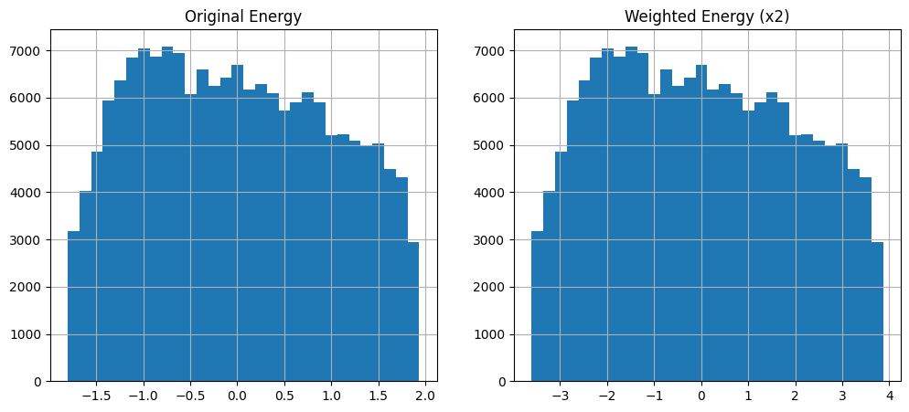
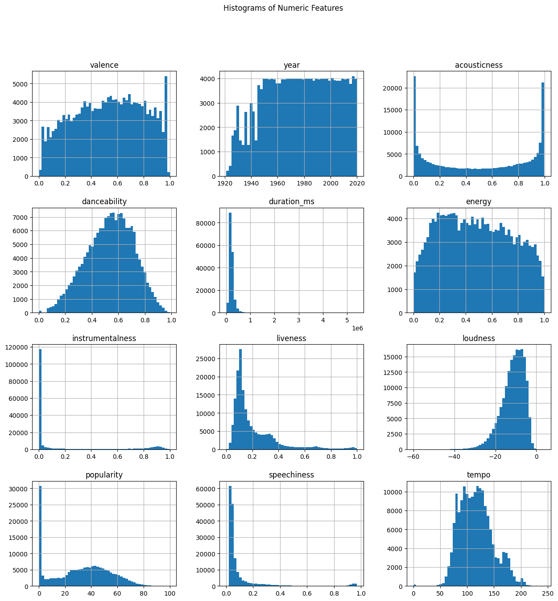
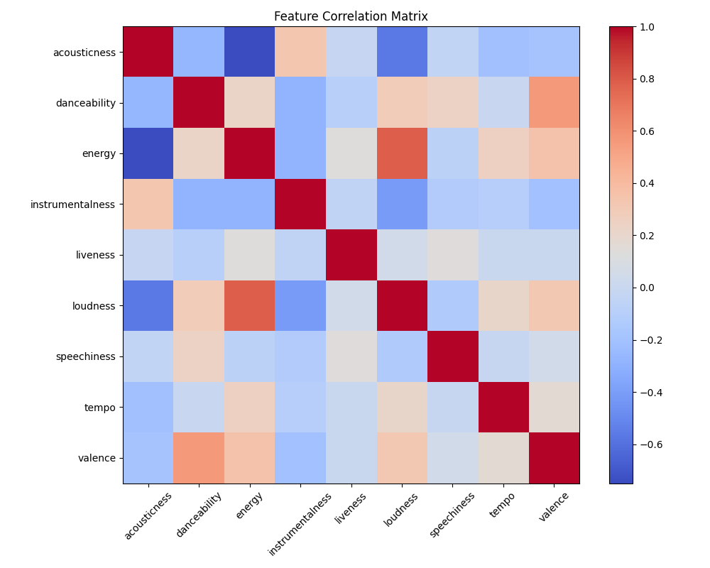
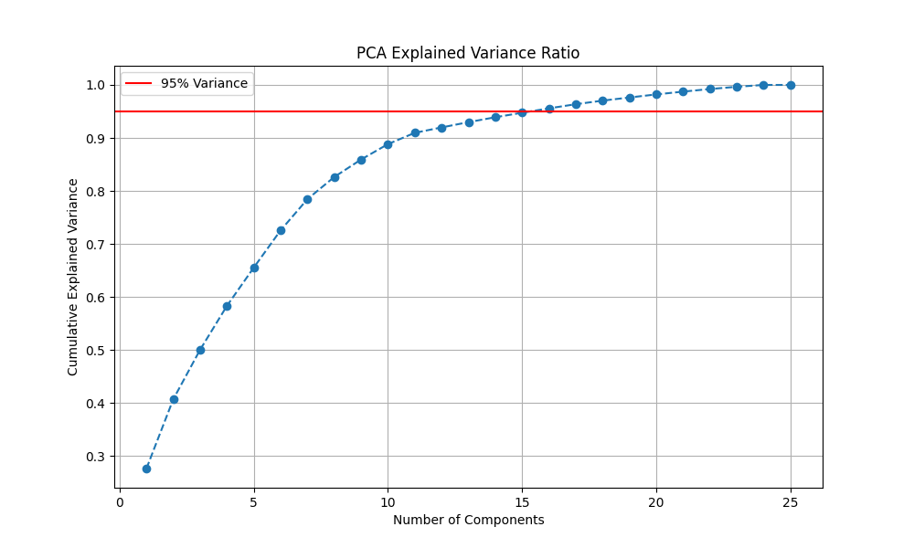
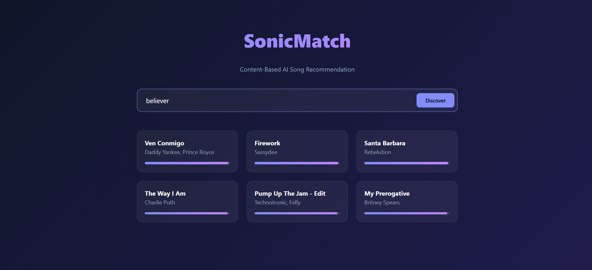

# 🎵 Advanced Song Recommendation Engine

A production-ready, content-based recommendation system built with **Python**, **Flask**, and **Scikit-Learn**. This system leverages Principal Component Analysis (PCA) and K-Nearest Neighbors (KNN) to analyze audio features and deliver personalized song recommendations.

## 📊 Visual Analysis

### Feature Weighting Impact
We experimented with feature weighting to emphasize specific acoustic properties (e.g., Energy, Valence). This plot demonstrates the shift in feature distribution before and after applying weights.


### Feature Distributions
A histogram overview of the key audio features across the dataset, showing the diverse range of the music catalog.


### Feature Correlation Matrix
We analyzed 12+ audio features to understand their linear relationships and redundancies.


### PCA Variance Ratio
To optimize performance, we used dimensionality reduction. This plot shows the cumulative explained variance, helping us choose the optimal number of components (27 were retained for full rank).


---

## 🚀 Key Features

*   **Content-Based Filtering**: Recommends songs based on acoustic properties rather than user history, solving the "cold start" problem.
*   **Web Interface**: A premium, dark-mode UI for interactive song discovery.
*   **Dimensionality Reduction**: Utilizes PCA to compress high-dimensional feature space.
*   **Hybrid Architecture**: Modular design separating Data Processing, Feature Engineering, and Model Inference.
*   **Deployment Ready**: includes a Flask API and HTML frontend.
*   **Vector Search**: Implements efficient similarity search using `sklearn.neighbors`.

## 🌐 Web Interface
The project includes a modern, responsive web frontend.
<!-- **Live Demo:** [INSERT DEPLOYED LINK HERE] -->


*(Run the app locally to see the UI)*

## 🛠️ Tech Stack

*   **Core**: Python 3.12, Pandas, NumPy
*   **Machine Learning**: Scikit-Learn (PCA, KNN, Cosine Similarity)
*   **API**: Flask
*   **Testing**: Pytest
*   **Visualization**: Matplotlib, Seaborn

## 📂 Project Structure

```bash
song-recommendation/
├── app.py                 # Flask API Entry Point
├── artifacts/             # Serialized Models & Scalers
├── assets/                # Images & Resources
├── data/                  # Raw Dataset
├── notebooks/             # Exploration & Experiments
├── scripts/               # Utility Scripts
├── src/                   # Source Code
│   ├── features.py        # Feature Engineering Logic
│   ├── models.py          # Recommendation Engine
│   ├── preprocessing.py   # Data Pipeline
│   └── recommend.py       # Service Layer
├── tests/                 # Unit & Integration Tests
└── requirements.txt       # Dependencies
```

## ⚡ Quick Start

### 1. Installation
Clone the repository and install dependencies:
```bash
git clone https://github.com/dhruv-atomic-mui21/songrecomendation.git
cd song-recommendation
pip install -r requirements.txt
```

### 2. Run the API
Start the Flask development server:
```bash
python app.py
```
The server will start at `http://localhost:5000`.

### 3. Get Recommendations
Send a POST request to the endpoint:

**Endpoint:** `POST /recommend`

**Body:**
```json
{
    "song_name": "Bohemian Rhapsody",
    "k": 5
}
```

**Response:**
```json
{
    "query_track": { ... },
    "recommendations": [
        {
            "name": "We Are The Champions",
            "artists": "['Queen']",
            "similarity_score": 0.985,
            ...
        },
        ...
    ]
}
```

## 🧪 Testing
Run the comprehensive test suite:
```bash
pytest
```

## 📝 License
MIT License.
